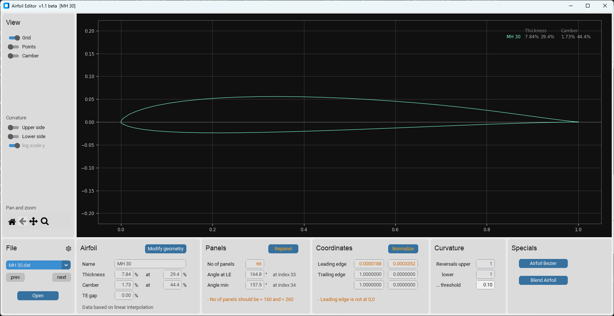

# Airfoil Editor


The `AirfoilEditor` as part of [PlanformCreator2](README.md), shows detailed information of an airfoil and allows to modify its main geometry parameters. 



Main features: 

* View an airfoil and browse through the airfoils of its subdirectory
* View the curvature of the airfoil surface
* Repanel and normalize the airfoil
* Modify the geometry parameters thickness, camber and their high points 
* Set trailing edge gap 
* Merge an airfoil with another airfoil 
* Create a Bezier based 'copy' of an airfoil 

The driver for this app was to overcome some of the artefacts using xfoils geometry routines (for example used in Xflr5) when trying to create geometric 'high quality' airfoils. The focus of the app is on pure geometry work with airfoils. 

## Basic concepts

The `AirfoilEditor` implements different "strategies" to analyse and modify the geometry of a coordinate based airfoil definition coming from the airfoils '.dat' file.

- 'Linear interpolation' - intermediate points between two coordinate points are evaluated with a simple linear interpolation. This is used for fast preview and basic operations
- 'Cubic spline interpolation' - a cubic spline is built based on the airfoils coordinate points. This allows to evlauate intermediate points with high precision 
- 'Bezier curve approximation' - an existing airfoil is approximated with two Bezier curves for upper and lower side.

The spline interpolation is used to find the position of the 'real' leading edge, which may differ from the leading edge of the coordinates (which is the point with the smallest x-value). When 'normalizing' the airfoil, the 'real' leading edge is taken in an iteration to rotate, stretch and move the airfoil to become 0,0 - 1,0 normalized.

For thickness and camber geometry operations the airfoil (spline) is splitted into two new splines representing thickness and camber distribution. For moving the highpoint of either thickness or camber a mapping spline for the airfoil coordinates is used quite similar to the approach implemented in xfoil. After these operations the airfoil is rebuild out of thickness and camber. 

Repaneling is based on a modified cosinus distribution of the airfoil points on the arc of the spline. This differs from the xfoil approach but the repanel shows are 'nice' behaviour in aero calculation. 

As an exmaple for the modification functionality of the app, the dialog for repaneling is shown:  


<sup>Dialog for repaneling of an airfoil. Recommendations are given for 'healthy' panel angles.  </sup>
</p>

### Curvature 

On of the major views on an airfoil in the Airfoil Editor is the curvature of the airfoils surface. It allows a quick assessment of the surface quality and to detect artefacts like a 'spoiler' at the trailing edge which is quite common. 

As the curvature changes from very high values at the leading edge to very low values towards the trailing edge, a logarithmic scale can be applied in the diagram to improve overview.  


## Bezier based airfoils 

A little bit hidden is the feature to define a (new) airfoil based on two Bezier curves for upper and lower side (The Bezier functionality was some pre-work for Bezier based airfoil optimization)  

The control points of the Bezier curve can be moved by mouse within their individual boundaries. 

The 'Match' function performs a best match of the Bezier curve to an existing airfoil. For this a Simplex optimization (Nelder Mead) is performed to 
- minimize the norm2 deviation between the Bezier curve and the target airfoil
- align the curvature of the Bezier curve at leading and trailing to the targets curvature.  


<sup>Dialog for Bezier curve approximation. In this example the upper Bezier curve having 7 control points was already 'Matched' using Simplex optimization. </sup>


##  Install

The 'Airfoil Editor' is part of the 'Planform Creator 2' repository. 
A pre-build Windows-Exe of both apps is available in the releases section https://github.com/jxjo/PlanformCreator2/releases  

or 

Download python sources from https://github.com/jxjo/PlanformCreator2/releases or Clone the repository 

and Install 

```
pip3 install numpy
pip3 install matplotlib
pip3 install customtkinter
pip3 install termcolor
pip3 install colorama
pip3 install ezdxf
```

 
Have fun!
